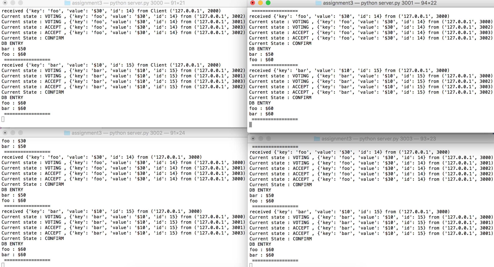
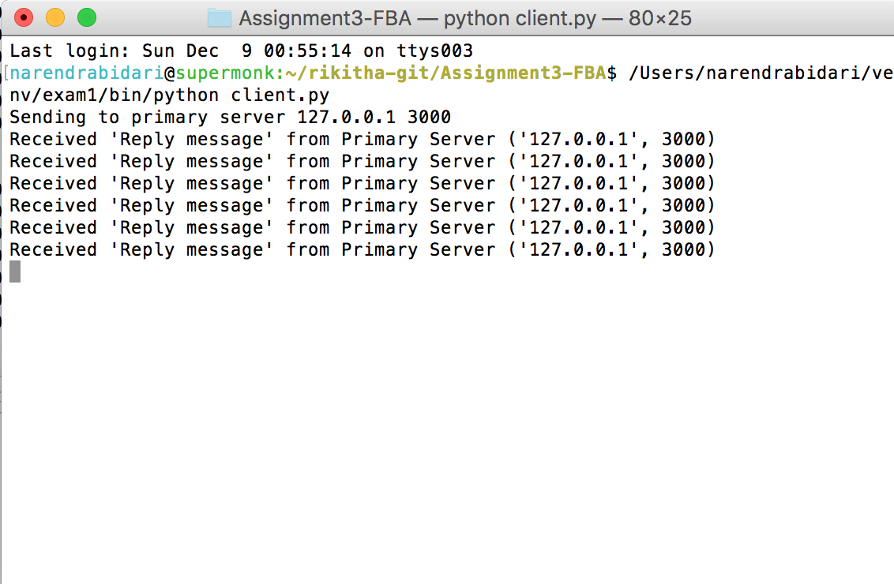

###Steps
```
1. Make all UDP connections
   - To send one data to another make initial connections (bind etc)
   - Here all the servers will trust each other. So quorum slice is all servers 
2. Client is running on port '127.0.0.1', 2000 . It will send the message to Primary Server ('127.0.0.1', 3000)
3. Voting State
    - Primary will send to all other servers. All other servers will send to every other server  
    - Save the count of the message for each server . 
    - If it is majority (reaches majority of its quorum slice) then state is ACCEPT
4. Accept state
    - Send ACCEPT messages to all others and if number of accepts recieved is majority then go to  Ratification step
5. Ratification
    Check if no of msgs from sevrer has met its quorum (majority)  
6.  Confirm state
    In confirm , store it in database and then send reply message form the primary server to the client
    (If key exists in db update it with addition of the value else add a new entry to db)  
7. .db files will be present in relative path
``` 
    
####Screenshots of the results

- FBA protocol messages in the servers




- Client Reply messages


